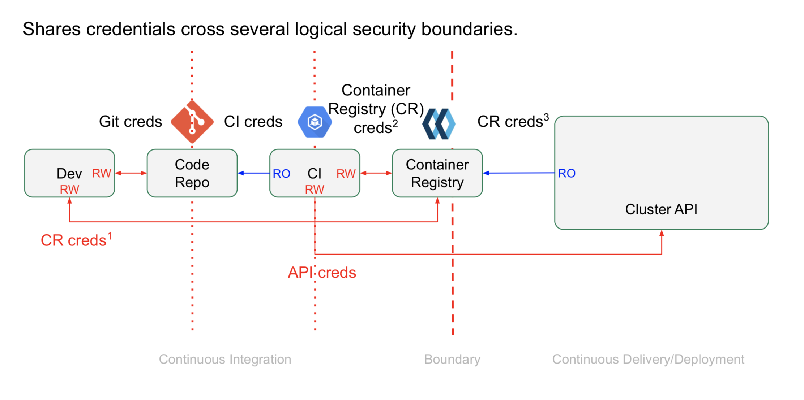
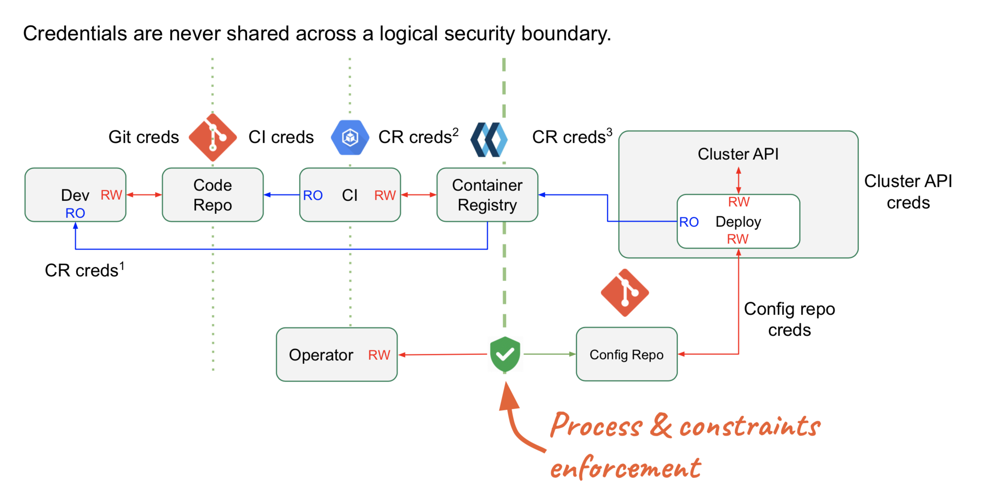

# lakeside-hackfest2019
DevOps conference in Klagenfurt, Lakeside Spitz am Wörthersee, organised by Dynatrace.

## Brice Fernandes Links: 
* https://github.com/bricef
* http://fractallambda.com

## Hands on GitOps - Brice Fernandes
*Engineer, Weaveworks*

**Slides:** [Hands on GitOps Slides](Hands-on-GitOps-Lakeside-hack-fest.pdf)

In this hands-on tutorial, Brice Fernandes from Weaveworks went through setting up and using a GitOps pipeline to manage a Kubernetes cluster. 
He showed us how to set up monitoring and metric visualisation as well as managing the monitoring configuration using GitOps.

### Some facts about Weaveworks 
* The team at Weaveworks is behind the GitOps model
* Building cloud-native OSS since 2014  (Weave Net, Moby, Kubernetes, Prometheus)
* Weave Cloud runs on Kubernetes since 2015

### Hands-on
* Environment - Cloud 9 IDE
* Mostly used Cluster Shell
* Check what is running on cluster:
	`kubectl get pods —all-namespaces`
* Weave Cloud - DevOps console
* Register, create new instance -> Kubernetes  -> Google Container Engine, Install Weave Cloud Agents
* Verify with:
	`kubectl get pods —all-namespaces`
* Result: Flux is running in the cluster => weave-flux-agent-….

### GitOps
* An operation model
* Technology agnostic
* A way to speed up your team

###  GitOps Model
* Don’t access directly Kubernetes Cluster
* Make Configuration Repository
* Deployment Agent (DA) checks this repository and deploy to Kubernetes
* Security boundary is before this DA
* Other resources and repos are also injected
* DA and Kubernetes are in controlled loop and state is continuously monitored

### Principles of GitOps
* The entire system is described declaratively. 
* The canonical desired system state is versioned (with Git) 
* Approved changes to the desired state are automatically applied to the system 
* Software agents ensure correctness and alert on divergence 

**GitOps is Functional Reactive Programming...for your infrastructure.**

* Typical CICD pipeline

* GitOps Pipeline

### GitOps CI/CD
* Having separate pipelines for CI and CD enables better security
* It’s also easier to deal with if a deployment goes wrong
* We built a few versions of a simple app, using a demo CI pipeline
* Deployed those versions to Kubernetes using Weave Cloud
* Automated the deployment
* Deployments, rollback and lock are all done via git
* Git is our single source of truth.

---
